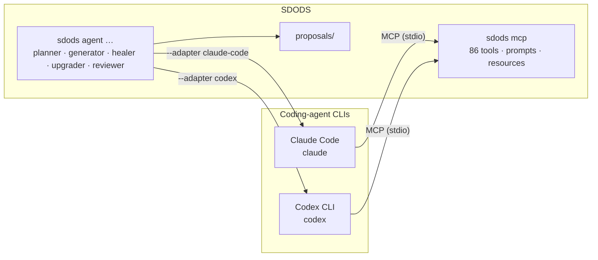

<Learn>
  How to register SDODS with Claude Code and Codex so they can drive your test platform, how to run
  SDODS's own agent roles through those CLIs instead of an API key, and what each client sees.
</Learn>

<Callout>
  The fastest start in Claude Code is the SDODS plugin — skills, slash commands, the five subagents
  and the MCP server in one install. It and every other client are in [Connect AI coding
  tools](/docs/guides/ai-coding-tools).
</Callout>

## Two directions



1. **The CLI drives SDODS.** Register the SDODS MCP server with the client; then ask it to list projects, run a suite, read a scenario's before/after screenshots, or write a feature proposal.
2. **SDODS drives the CLI.** `sdods agent … --adapter claude-code|codex` runs a role through the CLI's own login. No `ANTHROPIC_API_KEY` or `OPENAI_API_KEY` is needed; the CLI's subscription or account pays.

## Install SDODS with the MCP registration included

The installer can register the MCP server for you while it sets SDODS up:

```bash
curl -fsSL https://sdods.com/install.sh | sh -s -- --mcp all
```

`--mcp claude`, `--mcp codex` or `--mcp all` runs `sdods mcp install <client>` for the CLIs it finds
on your PATH, and skips (with a note) the ones you do not have. On Windows use `-Mcp all`. Everything
below works the same if you installed from a clone instead.

## Set up Claude Code

<Steps>

### Install and log in

```bash
npm i -g @anthropic-ai/claude-code
claude login
```

### Register SDODS

```bash
bun run sdods agent install --for claude -p demo-shop -e staging
```

This writes `.claude/agents/sdods-<role>.md` (one subagent per SDODS role), `CLAUDE.md`, `AGENT.md` and `SKILL.md`, and runs `claude mcp add -s project sdods -- npx -y @sdods/cli mcp --project demo-shop --env staging` (plus the bundled Playwright MCP). Use `--no-mcp` to skip the registration, or `sdods mcp install claude --file` to write `.mcp.json` instead of calling the CLI.

### Use it

```bash
claude
# > use the sdods tools to run the demo-shop smoke suite on chromium and summarise failures
# > @sdods-healer fix the "Add a product to the cart" scenario from the last run
```

`claude mcp list` shows `sdods`. Every SDODS tool appears as `mcp__sdods__<tool>`, browser tools included — `mcp__sdods__browser_navigate` and friends.

</Steps>

## Set up Codex CLI

<Steps>

### Install and log in

```bash
npm i -g @openai/codex
codex login          # ChatGPT account; or set OPENAI_API_KEY
```

### Register SDODS

```bash
bun run sdods agent install --for codex -p demo-shop -e staging
```

This writes `AGENTS.md` (Codex reads it as project instructions; the five roles become sections), `AGENT.md` and `SKILL.md`, and runs `codex mcp add sdods -- npx -y @sdods/cli mcp --project demo-shop --env staging` (plus Playwright). Without the CLI on PATH the same entries are merged into `~/.codex/config.toml` under `[mcp_servers.sdods]`; other servers in that file are kept.

### Use it

```bash
codex
# > use the sdods tools to list projects and start the api-contract process for demo-shop
codex mcp list
```

</Steps>

## Run SDODS agents on the CLI logins

```bash
bun run sdods agent review   -p demo-shop --adapter claude-code
bun run sdods agent heal     -p demo-shop --scenario <fingerprint> --adapter codex --max-turns 20
bun run sdods agent generate -p demo-shop --goal "checkout with a discount code"   # auto-detects
```

What the adapters do:

| Adapter       | Command executed                                                                                                                                                                              | Tools                                                    | Cost reporting                                  |
| ------------- | --------------------------------------------------------------------------------------------------------------------------------------------------------------------------------------------- | -------------------------------------------------------- | ----------------------------------------------- |
| `claude-code` | `claude -p <prompt> --output-format stream-json --mcp-config <temp.json> --strict-mcp-config --allowedTools Read Glob Grep mcp__sdods__* --disallowedTools Bash Write Edit … --max-turns <n>` | SDODS MCP (browser tools included), read-only file tools | `total_cost_usd` from the CLI when available    |
| `codex`       | `codex exec --json --ephemeral -s read-only -c mcp_servers.sdods.command=… -c mcp_servers.sdods.args=… <system + prompt>`                                                                     | SDODS + Playwright MCP, read-only sandbox                | token usage only (Codex reports no dollar cost) |

Both adapters keep the SDODS guarantee: roles can only write proposals (`sdods proposals list|show|accept`). When no adapter is chosen, SDODS auto-detects: `ANTHROPIC_API_KEY` → `claude` CLI → `codex` CLI → `OPENAI_API_KEY` → `fake`, and prints which one it picked.

<Callout type="info">
  `sdods doctor` shows both CLIs (installed, logged in) and the full token matrix. Pin a model with
  `SDODS_CLAUDE_CODE_MODEL` / `SDODS_CODEX_MODEL` or `--model`; by default the CLI's configured
  model is used.
</Callout>

## What each client sees

| Client                    | Reads                                                               | Gets from SDODS                                                      |
| ------------------------- | ------------------------------------------------------------------- | -------------------------------------------------------------------- |
| Claude Code               | `CLAUDE.md`, `.claude/agents/*.md`, `.claude/skills/*`, `.mcp.json` | MCP tools, prompts, resources; role subagents; the record/run skills |
| Codex                     | `AGENTS.md`, `~/.codex/config.toml`                                 | MCP tools, prompts, resources; role instructions as sections         |
| Cursor, VS Code, Windsurf | `.cursor/mcp.json`, `.vscode/mcp.json`, `.windsurf/mcp.json`        | MCP tools, prompts, resources                                        |

## Next steps

- [Tokens and keys](/docs/reference/tokens-and-keys): what is mandatory, one-of, optional.
- [Agents](/docs/guides/agents): the roles and their proposals.
- [MCP](/docs/guides/mcp): tool families, scopes, HTTP transport.
