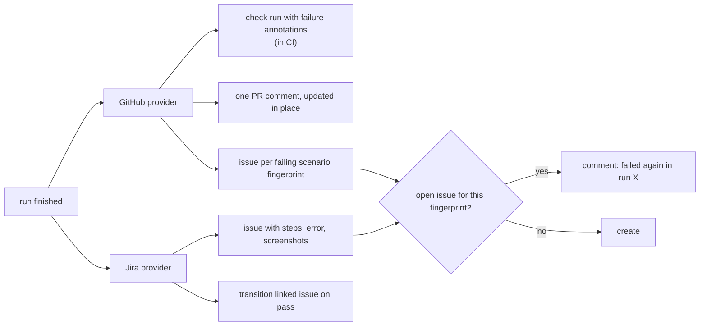

<Learn>
  How the GitHub and Jira providers are configured per project with secret names only, what each
  does on a finished run, how issues are deduplicated by scenario fingerprint, and how tags link
  scenarios to existing issues.
</Learn>

## Configure

```yaml title="sdods.project.yaml"
integrations:
  github:
    enabled: true
    owner: acme
    repo: shop
    checkRun: true
    prComment: true
    createIssueOnFailure: smoke # never | smoke | always
    labels: [sdods, test-failure]
    tokenEnv: GITHUB_TOKEN
  jira:
    enabled: true
    baseUrl: https://acme.atlassian.net
    projectKey: SHOP
    issueType: Bug
    emailEnv: JIRA_EMAIL
    tokenEnv: JIRA_API_TOKEN
    createIssueOnFailure: always
    transitionOnPass: Done
    linkTaggedScenarios: true
```

Only variable **names** are stored; values come from the environment where `sdods` runs.

The GitHub token needs `issues: write` for issues and labels, `checks: write` for check runs and `pull-requests: write` for the PR comment:

```yaml title=".github/workflows/e2e.yml"
permissions:
  contents: read
  issues: write
  checks: write
  pull-requests: write
```

## What happens after a run

`sdods run` publishes the run to every enabled integration when it finishes; no separate step is needed. Pass `--no-notify` to skip it, for example when shards run in parallel jobs and a later job merges them and runs `sdods integrations notify --run-id <id> --from-files` once (sharded runs never notify on their own). A notify failure is reported as a warning and does not change the run's exit code.



Before creating an issue, SDODS searches the repository for an open issue whose body carries the scenario's `sdods-fingerprint:<fingerprint>` marker, so a fresh CI runner without `.sdods/issue-links.json` comments on the existing issue instead of opening a duplicate. Notifying the same run twice does not comment twice.

Issue bodies include the scenario, the error, screenshots and the runner's `video.webm` for the failing attempt. Each file is linked from the first of these that has it:

1. the [evidence branch](#evidence-that-renders-in-private-repositories), with `evidence.host: branch`;
2. a release asset, with `uploadToRelease`;
3. `SDODS_PUBLIC_URL`, when a server is configured;
4. the CI run's artifacts, with the path inside them.

Only the evidence branch renders images inline in a private repository. Release assets and artifacts are links a reader has to download.

### Traces are never attached

<Callout type="warn">
  A Playwright `trace.zip` contains credentials: every request's `Cookie` and `Authorization`
  headers, `Set-Cookie` responses, the browser storage of the signed-in account (for Firebase, the
  long-lived refresh token in localStorage/IndexedDB) and the values typed into forms. Do not attach
  traces to issues, commit them, push them to an evidence branch or upload them as release assets.
</Callout>

Neither provider uploads, attaches or links `trace.zip`, with or without `uploadToRelease`. The issue names the trace's local path (or its path inside the CI run's artifacts) under a warning, with the command to open it on a machine that already has the run:

```bash
sdods trace .sdods/runs/<runId>/runner-output/<test>/trace.zip   # or: sdods trace --run <runId>
```

`sdods run` also redacts every trace after the run (`evidence.redactTraces`, on by default): credential headers, cookies, storage and password values become `[redacted]`. Redaction does not cover request or response bodies, page text or screenshots, so a redacted trace is still not for publishing. On a public repository, anyone signed in to GitHub can download a workflow's artifacts; keep traces out of uploaded artifacts there, or set `evidence.trace: off` in CI.

The video is still linked: it shows the screen, not headers or storage, and password fields render masked. If the application prints tokens or one-time codes on screen, set `evidence.video: off` as well.

If a trace has already been published, revoke the sessions and refresh tokens of the accounts it recorded; deleting the file or rewriting history does not invalidate them.

## Evidence that renders in private repositories

With `evidence.host: branch`, SDODS commits each run's screenshots, video and GIF preview to a branch and embeds them as `https://github.com/<owner>/<repo>/blob/<branch>/<path>?raw=true`. GitHub renders these inline for anyone who can read that repository. It is off by default.

```yaml title="sdods.project.yaml"
integrations:
  github:
    enabled: true
    createIssueOnFailure: smoke
    tokenEnv: GITHUB_TOKEN
    evidence:
      host: branch # none (default) | branch
      repo: acme/shop-evidence # default: the issue repository
      branch: sdods-evidence
      tokenEnv: EVIDENCE_TOKEN # default: tokenEnv
      maxFileBytes: 5242880 # 5 MB per file
      maxRunBytes: 26214400 # 25 MB per run
      retainDays: 14 # default age for evidence prune
      gifPreview: true # needs ffmpeg on PATH
```

<Callout type="warn">
  Pushing evidence needs `contents: write`, and a token with `contents: write` on the code
  repository can also push code to it. To avoid that, point `evidence.repo` at a separate private
  repository and give `evidence.tokenEnv` a fine-grained token that can write only there. Create
  that repository with a README: the GitHub API cannot write to an empty repository. Everyone who
  can read the evidence repository can open every screenshot and video in it, and screenshots show
  whatever test data was on screen. `sdods integrations test` warns when the evidence repository is
  public and the issue repository is private.
</Callout>

How it works:

- **Branch.** The branch is an orphan (its first commit holds only a README) and is created on the first upload through the GitHub API; nothing is cloned. Do not base work on it. `evidence.branch` must be a branch of its own: `main`, `master`, `develop`, `development`, `trunk` and `gh-pages` are rejected in the project file, and uploads, prune and `sdods integrations test` refuse the repository's default branch, whatever its name.
- **Layout.** Files go under `runs/<runId>/<scenario>-<fingerprint>/`, and `runs/index.json` records when each run was uploaded.
- **One commit per run.** The files of every issue a run creates go up in a single commit on top of the current head, and the ref moves only as a fast-forward. When another job moves the branch first, GitHub rejects the update (HTTP 422). SDODS rebuilds the commit on the new head and retries up to 5 times with backoff. If it still cannot, it logs a warning and the issue uses the links from the list above.
- **Size caps.** Screenshots are taken first, then GIF previews, then videos. A file over `maxFileBytes`, or one that would take the run past `maxRunBytes`, is not uploaded. The issue lists it under **Evidence not uploaded** with the reason and links it the old way.
- **GIF preview.** When `ffmpeg` is on PATH and the scenario has a `video.webm`, SDODS embeds a GIF of the last 5 seconds (480 px wide, 8 fps, at most 3 MB). Without ffmpeg, or when the conversion fails, it skips the preview and logs at debug level.
- **Traces.** Traces are never committed, as described [above](#traces-are-never-attached).
- **Tokens.** The token needs `contents: write` on the evidence repository. To use the workflow's `GITHUB_TOKEN` on the issue repository, change `contents: read` to `contents: write` in the workflow's `permissions`.

`sdods integrations test` then also checks the evidence host. It reads the token's `push` permission on the repository and whether the branch exists (otherwise the first upload creates it). For a token whose repository response carries no permissions, it writes one unreferenced blob instead.

### Retention

Evidence stays in the branch's history until the branch is rewritten. `evidence prune` replaces the branch with a new orphan commit that keeps only the runs uploaded within the cutoff (default `retainDays`), then force-updates the ref:

```bash
sdods integrations evidence prune -p demo-shop --older-than 14d --dry-run
```

```bash
sdods integrations evidence prune -p demo-shop
```

Run it on a schedule, for example weekly. Kept runs keep their paths, so their links keep working. Images in issues about pruned runs stop rendering. GitHub garbage-collects the dropped objects on its own schedule, so the repository does not shrink right away. Prune refuses a branch that SDODS did not create, recognised by the `# SDODS evidence` README its first commit writes, so pointing `evidence.branch` at an existing branch can never erase that branch's history. Run directories missing from `runs/index.json` are kept, because their age is unknown. Just before the force update, prune checks whether the branch moved and, if so, starts over on the new head. A force update cannot be made conditional, though, so a run pushed in the moment between that check and the update is lost. Run prune when no CI job is uploading. Uploads log a reminder when the branch holds runs older than `retainDays`.

## Link scenarios to issues

```gherkin
@ui @regression @jira:SHOP-42 @github:123
Scenario: Discount code applies
```

`sdods integrations sync -p demo-shop` scans features for these tags, creates links, and refreshes their status. The run viewer shows the status next to the scenario.

## Commands

```bash
bun run sdods integrations test -p demo-shop --provider github
bun run sdods integrations test -p demo-shop --provider github --create-labels
bun run sdods integrations notify --run-id <id> --from-files --dry-run
bun run sdods integrations sync -p demo-shop
bun run sdods integrations links -p demo-shop
```

`--from-files` builds the summary from the run directory, so notifications work without a database.

## Next steps

- [Sharding and CI](/docs/guides/sharding-and-ci)
- [Security](/docs/guides/security)
