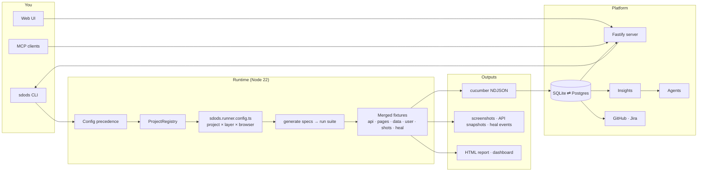

<Learn>
  What SDODS is, which problems it takes off your plate, the CLI-first principle that shapes every
  feature, and how the packages fit together.
</Learn>

SDODS is open-source BDD test automation for UI and API that leaves evidence behind every run: before/after screenshots, the requests that produced them, and a history of every run. You write scenarios in Gherkin, keep one YAML file per project and one per environment, and drive everything from the `sdods` command line. The same commands power the web UI, the MCP server and the scheduler.

<AgentInstall />

## What it gives you

| Concern                            | A bare test runner                     | With SDODS                                                                                                        |
| ---------------------------------- | -------------------------------------- | ----------------------------------------------------------------------------------------------------------------- |
| UI, API and hybrid scenarios       | separate test files, separate fixtures | one merged fixture set; one scenario can seed through the API and assert in the browser                           |
| Many applications and environments | one hand-written config                | `projects/<slug>/sdods.project.yaml` and `envs/<env>.yaml`, generating a run target per project × layer × browser |
| Configuration                      | environment variables and code         | six layers with fixed precedence, validated, explainable with `sdods config show --explain`                       |
| Test data                          | ad hoc                                 | CSV, JSON, YAML, database tables and factories per environment; user pools leased per worker                      |
| Results                            | HTML report                            | before/after screenshots per step, API snapshots, run history in SQLite or Postgres, insights                     |
| Resilience                         | none                                   | scored self-healing locators with persisted history                                                               |
| Tooling around tests               | none                                   | MCP server, AI agents that write reviewable proposals, GitHub and Jira, cron schedules, web UI                    |

## The CLI-first principle

Every capability is an `sdods` command that works with no server and no database. The web UI, the MCP server and the scheduler spawn those commands and stream their output. CI needs nothing but Node and the repository.

```bash
bun run sdods run -p demo-shop -e staging -l api
bun run sdods run -p demo-shop -e staging -l ui -b chromium -t @smoke
```

## How it works



## Packages

| Package               | Owns                                                                                                                          |
| --------------------- | ----------------------------------------------------------------------------------------------------------------------------- |
| `@sdods/contracts`    | Zod schemas for the YAML files, identifiers, attachment names, scopes, shared types                                           |
| `@sdods/core`         | configuration, project registry, fixtures, step library, data providers, screenshots, self-healing, recorder, lint, reporters |
| `@sdods/db`           | Kysely schema, migrations, ingest, insights                                                                                   |
| `@sdods/mcp`          | tool registry and MCP transports                                                                                              |
| `@sdods/integrations` | GitHub and Jira providers                                                                                                     |
| `@sdods/agents`       | LLM adapters, agent roles, proposals                                                                                          |
| `@sdods/server`       | REST, SSE, `/mcp`, authentication, scheduler                                                                                  |
| `@sdods/web`          | the React application                                                                                                         |
| `@sdods/cli`          | the `sdods` command                                                                                                           |

The test workers, vitest and the native database drivers run on Node 22. Bun is the package manager, script runner and bundler; pnpm works too. Nothing executes tests under Bun.

## Status

All fourteen phases are implemented and verified; the [roadmap](/docs/roadmap) walks them as five delivered chapters, with the numbers each claim rests on and the twelve months ahead. What is still open is listed on the [known limitations](/docs/reference/known-limitations) page. SDODS is released: `@sdods/cli` and the other `@sdods/*` packages are on npm, each version has a GitHub release, and the server is published as a container image on GHCR. See [Installation](/docs/getting-started/installation).

<Screenshot
  src="/screenshots/ui/run-detail.png"
  alt="The web UI run view: scenario tree grouped by module with flaky, healed and browser badges"
  caption="A run in the web UI. Every action it offers is an sdods command."
/>

## Next steps

- [Install SDODS](/docs/getting-started/installation)
- [Your first API test](/docs/getting-started/first-api-test)
- [Glossary](/docs/glossary)
