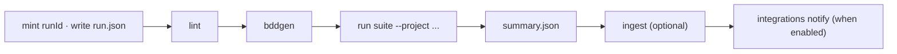

## `run` (alias `test`)

```text
sdods run [-p <slug>] [-e <env>] [-t <expr>] [-l <layer>]... [-b <browser>]... [-m <module>]... [--process <name>]
            [--project-matrix] [--device <name>] [--install-browsers] [--headed] [-w <n>] [--shard <i/n>] [--retries <n>]
            [--trace <mode>] [--video <mode>]
            [--grep <pattern>] [--feature <path>] [--scenario <name>] [--run-id <id>] [--artifacts-dir <dir>]
            [--no-lint] [--ingest | --no-ingest] [--no-notify] [--allure] [--har-update | --har-replay] [--strict]
            [--update-snapshots] [--ui] [--debug] [--list] [--open <when>] [--repeat-each <n>] [--fail-on-flaky]
            [--max-failures <n>] [--timeout <ms>] [--reporter <name[=file]>]... [--reporter-mode <mode>] [--trigger <kind>]
```

| Flag                       | Meaning                                                                                                                                                                                                                                                                       |
| -------------------------- | ----------------------------------------------------------------------------------------------------------------------------------------------------------------------------------------------------------------------------------------------------------------------------- |
| `-p, --project <slug>`     | project slug (default: the only project, otherwise required)                                                                                                                                                                                                                  |
| `-e, --env <name>`         | environment (default: `envs.default`)                                                                                                                                                                                                                                         |
| `-t, --tags <expr>`        | Cucumber tag expression, e.g. `"@smoke and not @mock"`; a comma list means OR                                                                                                                                                                                                 |
| `-l, --layer <layer>`      | `ui`, `api`, `hybrid`, `recorded`; repeatable                                                                                                                                                                                                                                 |
| `-b, --browser <name>`     | `chromium`, `edge`, `firefox`, `webkit`, `mobile-chrome`, `mobile-safari`; repeatable                                                                                                                                                                                         |
| `-m, --module <name>`      | restrict to a module; repeatable                                                                                                                                                                                                                                              |
| `--process <name>`         | apply a named process from the project or workspace YAML; explicit flags override its fields                                                                                                                                                                                  |
| `--project-matrix`         | every browser declared in the project YAML                                                                                                                                                                                                                                    |
| `--device <name>`          | device name for mobile emulation, e.g. `"iPhone 15"`                                                                                                                                                                                                                          |
| `--install-browsers`       | download any test browser the run needs that is missing, into the cache the runner reads, before specs are generated (also `SDODS_AUTO_INSTALL_BROWSERS=1`, which the desktop app sets); without it a missing browser stops the run with the `sdods browsers install` command |
| `--headed`                 | visible browsers                                                                                                                                                                                                                                                              |
| `-w, --workers <n>`        | parallel workers                                                                                                                                                                                                                                                              |
| `--allow-pool-contention`  | run even when a `@user:` role has fewer pool accounts than the scenarios that could lease it at once (otherwise exit 2, `USER_POOL_TOO_SMALL`)                                                                                                                                |
| `--shard <i/n>`            | shard, e.g. `1/3`                                                                                                                                                                                                                                                             |
| `--retries <n>`            | retries per test (default: `retries.ci` in CI, `retries.local` elsewhere)                                                                                                                                                                                                     |
| `--trace <mode>`           | Playwright trace mode, e.g. `on`, `off` (default: `evidence.trace`); traces are redacted after the run unless `evidence.redactTraces: false`                                                                                                                                  |
| `--video <mode>`           | Playwright video mode (default: `evidence.video`)                                                                                                                                                                                                                             |
| `--grep <pattern>`         | filter tests by title (regular expression)                                                                                                                                                                                                                                    |
| `--feature <path>`         | only this feature file (relative to `features/`)                                                                                                                                                                                                                              |
| `--scenario <name>`        | only scenarios whose title contains this text                                                                                                                                                                                                                                 |
| `--run-id <id>`            | run id (default: UUID v7)                                                                                                                                                                                                                                                     |
| `--artifacts-dir <dir>`    | artifacts root (default: `.sdods/runs`)                                                                                                                                                                                                                                       |
| `--no-lint`                | skip feature lint before running                                                                                                                                                                                                                                              |
| `--ingest` / `--no-ingest` | force or skip database ingest (default: ingest when a database is configured)                                                                                                                                                                                                 |
| `--no-notify`              | do not publish the run to enabled integrations (default: notify when any is enabled)                                                                                                                                                                                          |
| `--allure`                 | also produce `allure-results`                                                                                                                                                                                                                                                 |
| `--har-update`             | record or refresh HAR files for `@har` scenarios                                                                                                                                                                                                                              |
| `--har-replay`             | replay HAR files for `@har` scenarios                                                                                                                                                                                                                                         |
| `--strict`                 | with `--har-replay`: abort any request that is not in the HAR (offline run)                                                                                                                                                                                                   |
| `--update-snapshots`       | overwrite `@visual` baselines without review and print a warning; prefer [`sdods baselines`](/docs/reference/cli-commands/baselines)                                                                                                                                          |
| `--ui`, `--debug`          | interactive UI mode, step debugger                                                                                                                                                                                                                                            |
| `--list`                   | print the run targets and tests that would run, then stop                                                                                                                                                                                                                     |
| `--open <when>`            | open the SDODS dashboard after the run: `always`, `on-failure` or `never`. Default `on-failure` at an interactive terminal, `never` in CI, under a coding agent, with `--json` or when output is piped; `SDODS_OPEN` sets it too                                              |
| `--repeat-each <n>`        | repeat each test n times                                                                                                                                                                                                                                                      |
| `--fail-on-flaky`          | exit `1` when any test is flaky                                                                                                                                                                                                                                               |
| `--max-failures <n>`       | stop after n failures                                                                                                                                                                                                                                                         |
| `--timeout <ms>`           | per-test timeout override                                                                                                                                                                                                                                                     |
| `--reporter <name[=file]>` | reporter override; repeatable                                                                                                                                                                                                                                                 |
| `--reporter-mode <mode>`   | `default`, `server` (line output for the web UI), `quiet`                                                                                                                                                                                                                     |
| `--trigger <kind>`         | recorded in `run.json`: `cli`, `ui`, `ci`, `agent`, `mcp`, `schedule` (default `cli`)                                                                                                                                                                                         |

Lifecycle:



When the project enables an integration (`integrations.github`, `integrations.jira` or a custom provider), the run ends by publishing itself exactly as `sdods integrations notify --run-id <id>` does: check runs, the PR comment, and issues per `createIssueOnFailure`. A notify failure is printed as a warning and never changes the exit code; `--json` output carries the outcome under `notify`. Cancelled runs, runs with no scenario results and sharded runs (`--shard`) do not notify — notify once after merging shards. Pass `--no-notify` when a later CI step runs `sdods integrations notify` itself.

### Console output

Each scenario prints one line: `[n/total]`, its status, `Feature › Scenario` and its target, such as `[ui · chromium]`. Failures follow with the feature file, the error, the failure screenshot and video, and an `sdods trace <zip>` command. The run ends with the command that opens the results (`sdods report --run <id> --open`). The console shows `sdods` commands only; the HTML report and trace viewer it links to are Playwright's own, since SDODS runs on Playwright.

Generated specs go to `.features-gen/<runId>/<slug>/<layer>/` and are removed after the run, so concurrent runs never race. When a tag expression matches no scenario the run exits `0` with a warning.

Exit codes: `0` pass, `1` failures, `2` configuration error, `3` lint errors, `130` cancelled.

```bash
bun run sdods run -p demo-shop -e staging -l api
bun run sdods run -p demo-shop -e staging -l ui -b chromium -t @smoke
bun run sdods run -p demo-shop -e staging --project-matrix -t "@smoke or @sanity"
bun run sdods run -p demo-shop --process api-contract
bun run sdods run -p demo-shop --module cart -t @regression --list
```

See also [`sdods watch`](/docs/reference/cli-commands/watch) for the hot-reload variant.
